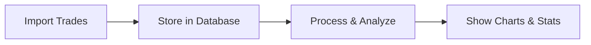

# Trading Journal App - Simple Documentation

## What is this app?

A web-based trading journal that helps traders track and analyze their trading performance. Think of it as a smart diary for your trades with automatic calculations and visual insights.

## Main Features

1. 📊 **Trade Tracking**
   - Import your trades from trading platforms
   - See all your trades in an organized table
   - Filter and group trades however you want

2. 📈 **Performance Analysis**
   - View your equity growth chart
   - See key statistics (win rate, profit/loss, etc.)
   - Analyze trade patterns

3. ⚙️ **Settings & Tools**
   - Customize your preferences
   - Manage your data
   - Import/export trades

## How it Works

### Data Flow


### Main Parts of the App

1. **Pages**
   - Dashboard: Your main overview
   - Trades: List of all your trades
   - Import: Add new trades
   - Settings: Configure your preferences

2. **Key Components**
   - Charts: Show your performance visually
   - Trade Table: List and filter trades
   - Stats Display: Show key metrics
   - Import Tool: Get trades into the system

### Technical Stack

- **Frontend**: Next.js (React framework)
- **Database**: SQL database for storing trades
- **APIs**: 
  - Internal APIs for data management
  - Yahoo Finance for market data

## Common Tasks

### 1. Adding New Trades
```
Import Page → Select File → Review → Save
```

### 2. Viewing Performance
```
Dashboard → View Charts → Check Stats
```

### 3. Analyzing Specific Trades
```
Trades Page → Use Filters → Group/Sort as needed
```

## Directory Guide

Important folders and what they do:

```
src/
├── app/              # Main pages
├── components/       # UI building blocks
│   ├── dashboard/   # Charts and stats
│   └── trades/      # Trade management
├── lib/             # Core functionality
│   ├── hooks/       # Data processing
│   └── utils/       # Helper functions
```

## Making Changes

### Adding Features
1. Decide what you want to add
2. Check which files need changes
3. Make the changes
4. Update this documentation

### Fixing Issues
1. Find where the problem is
2. Check related components
3. Fix the issue
4. Test everything works

## Tips for Developers

1. **Start Here**
   - Look at `src/app/page.tsx` for the main dashboard
   - Check `src/types/trade.ts` for data structures
   - Browse `src/components/` for UI parts

2. **Common Patterns**
   - Use hooks for data processing
   - Keep components focused on one job
   - Follow existing code style

3. **Best Practices**
   - Write clear comments
   - Test your changes
   - Update documentation

## Need Help?

1. Check the code comments
2. Look at similar components
3. Review the test files
4. Ask team members

## Quick Reference

### Key Files
- `src/types/trade.ts` - Trade data structure
- `src/lib/hooks/useTradeProcessing.ts` - Trade calculations
- `src/components/dashboard/EquityChart.tsx` - Performance chart

### Common Operations
- Getting trade data: `useTrades` hook
- Processing trades: `useTradeProcessing` hook
- Showing stats: `StatsGrid` component

### API Routes
- `/api/trades` - Manage trades
- `/api/stats` - Get statistics
- `/api/migrations` - Database updates

---

This simplified documentation provides a clear overview while maintaining important technical details. It's organized to be both beginner-friendly and useful for experienced developers.