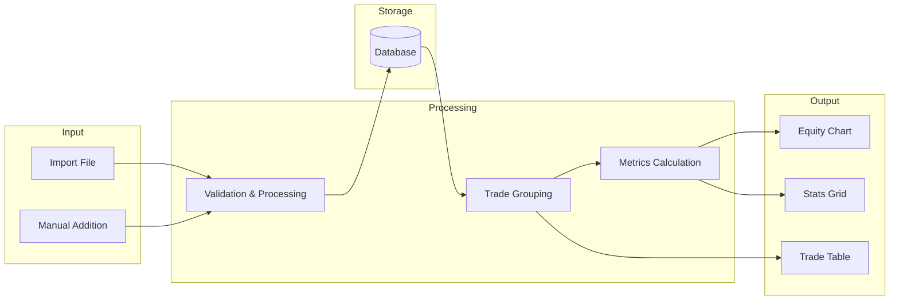
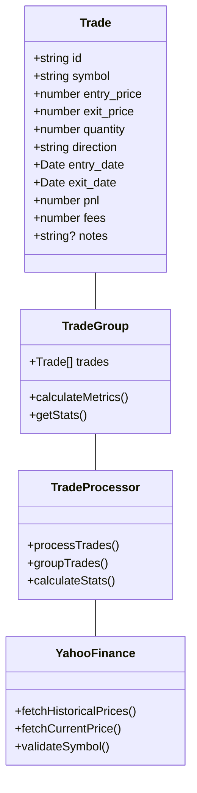
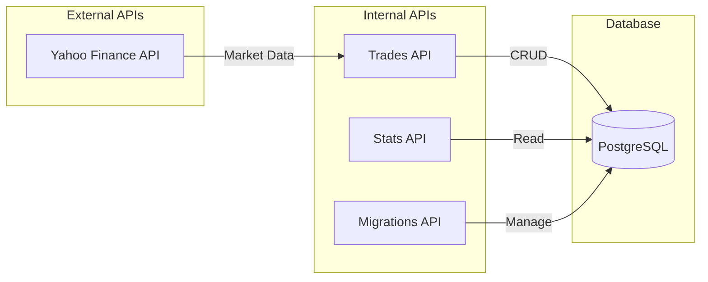
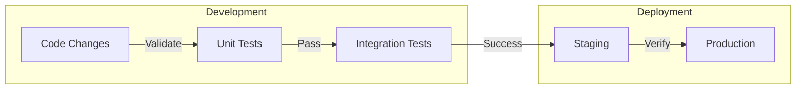

# System Dependencies and Knowledge Graph

## Component Relationships

```mermaid
graph TB
    subgraph Frontend
        Dashboard[Dashboard page]
        Trades[Trades page]
        Import[Import page]
        Settings[Settings page]
    end

    subgraph Components
        EquityChart[EquityChart]
        StatsGrid[StatsGrid]
        TradeTable[TradeTable]
        TradeFilters[TradeFilters]
        ImportTrades[ImportTrades]
    end

    subgraph Hooks
        useTradeProcessing[useTradeProcessing]
        useGroupedTrades[useGroupedTrades]
        useTradeStats[useTradeStats]
        useTradeGroupMetrics[useTradeGroupMetrics]
    end

    subgraph API
        TradesAPI[/api/trades]
        StatsAPI[/api/stats]
        MigrationsAPI[/api/migrations]
    end

    subgraph Utils
        YahooFinance[yahoo-finance.ts]
        Format[format.ts]
        TickerMapping[ticker-mapping.ts]
    end

    %% Frontend Dependencies
    Dashboard --> EquityChart
    Dashboard --> StatsGrid
    Trades --> TradeTable
    Trades --> TradeFilters
    Import --> ImportTrades

    %% Component Dependencies
    EquityChart --> useTradeStats
    StatsGrid --> useTradeStats
    TradeTable --> useGroupedTrades
    TradeFilters --> useGroupedTrades
    ImportTrades --> TradesAPI

    %% Hook Dependencies
    useTradeProcessing --> TradesAPI
    useGroupedTrades --> useTradeProcessing
    useTradeStats --> useTradeProcessing
    useTradeGroupMetrics --> useGroupedTrades

    %% API Dependencies
    TradesAPI --> YahooFinance
    YahooFinance --> TickerMapping
    TradesAPI --> Format
```

## Data Flow Diagram



## Critical Code Paths

```mermaid
graph TD
    subgraph Trade Import
        A[Import File] -->|Validation| B[Parse Data]
        B -->|Processing| C[Store Trades]
        C -->|Update| D[Refresh Views]
    end

    subgraph Performance Calculation
        E[Fetch Trades] -->|Group| F[Calculate Metrics]
        F -->|Aggregate| G[Update Stats]
        G -->|Render| H[Display Charts]
    end

    subgraph Real-time Updates
        I[Price Update] -->|Fetch| J[Yahoo Finance]
        J -->|Process| K[Update Trade]
        K -->|Recalculate| L[Update UI]
    end
```



## Module Interface Map



## Key API Interfaces



## Development Workflow



This knowledge graph provides a comprehensive view of:
1. Component relationships and dependencies
2. Data flow through the system
3. Critical code paths and their interactions
4. Module interfaces and their connections
5. API architecture and database interactions
6. Development and deployment workflow

Use this documentation to:
- Understand system architecture
- Track dependencies between components
- Identify potential bottlenecks
- Plan feature implementations
- Guide code reviews
- Assist in debugging